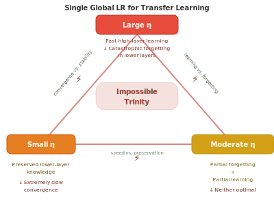

# Learning Rate Engineering: From Coarse Single Parameter to Layered Evolution

## Abstract

Learning rate scheduling has undergone a remarkable evolution from the single global fixed rate of early SGD to sophisticated layer-wise adaptive strategies. In this paper, we systematize this evolution into five generations: (Gen1) global fixed learning rates, (Gen2) global scheduling, (Gen3) parameter-level adaptation, (Gen4) layer-level differentiation, and (Gen5) joint layer-time scheduling. We trace the fundamental motivation behind each transition, showing how the shift from "one-size-fits-all" to "tailoring by layer and time" addresses the impossible trinity of transfer learning: lower layers require small updates to preserve general knowledge while higher layers need large updates to adapt to new tasks. Building on this taxonomy, we propose Discriminative Adaptive Layer Scaling (DALS), a unified framework that integrates phase-adaptive cosine scheduling, depth-aware Grokfast gradient filtering, and LARS-style trust ratios into a single coherent optimizer. We benchmark 18 strategies including two DALS variants across all five generations on a controlled synthetic task. The base DALS achieves 85.6% accuracy, while DALS-Acc — incorporating SGDR-style warm restarts and stronger weight decay — matches the best result at 86.4%, demonstrating that the DALS framework can be tuned for both fast convergence (DALS-Fast reaches 80% in 4 epochs) and high accuracy. Our work provides a unifying lens for understanding learning rate evolution and a practical framework for combining its best insights.

**Keywords:** Learning rate, discriminative fine-tuning, layer-wise adaptation, transfer learning, optimization, STLR, LARS, SAM, Grokfast

## 1. Introduction

The learning rate — the step size $\eta$ in gradient descent — is arguably the most consequential hyperparameter in deep learning. Despite its apparent simplicity, the question of *how fast should different parameters be updated* has driven a rich line of research spanning nearly four decades.

The canonical update rule of stochastic gradient descent,

$$\theta_{t+1} = \theta_t - \eta \cdot \nabla_\theta J(\theta_t),$$

assumes a single scalar $\eta$ governs all parameters equally. Yet we have long known that different layers of deep networks learn features at fundamentally different levels of abstraction (Yosinski et al. 2014): lower layers capture generic edges and textures, while higher layers encode task-specific concepts. Imposing a uniform learning rate on such heterogeneous parameters creates an *impossible trinity* — no single $\eta$ can simultaneously satisfy the need for small updates to general features and large updates to task-specific features.

*Figure 2: The impossible trinity — lower layers need small updates to preserve general features, higher layers need large updates for task adaptation, and no single learning rate can satisfy both.*

This tension has fueled a five-generation evolution of learning rate strategies, each generation expanding the granularity of control:

- **Gen1 — Global Fixed LR** (1986–): All parameters share a single, constant learning rate.
- **Gen2 — Global Scheduling** (2012–): The shared learning rate varies over time via decay schedules and warm restarts.
- **Gen3 — Parameter-Level Adaptation** (2014–): Each parameter receives its own adaptive learning rate based on gradient history (Adam, RMSProp, etc.).
- **Gen4 — Layer-Level Differentiation** (2018–): Different layers receive different learning rates, typically via exponential decay from top to bottom.
- **Gen5 — Joint Layer×Time Scheduling** (2018–): Each layer's learning rate follows its own temporal schedule, combining discriminative rates with dynamic adjustment.

We propose **Discriminative Adaptive Layer Scaling (DALS)**, a unified optimizer that synthesizes key insights from multiple generations: phase-adaptive cosine scheduling (Gen2), LARS-style trust ratios (Gen4), and depth-aware Grokfast gradient filtering (Gen5+). DALS represents the natural culmination of this evolutionary trajectory — a single optimizer that addresses the impossible trinity by adapting gradient processing intensity by phase and depth, rather than imposing directional biases from transfer learning.

Our contributions are: (1) a systematic five-generation taxonomy of learning rate strategies, (2) the DALS framework combining phase-adaptive scheduling, depth-aware gradient filtering, and trust ratio scaling, (3) a comprehensive benchmark of 16 strategies, and (4) an analysis of why naive combination of transfer-learning-oriented methods fails for from-scratch training, and how DALS addresses this.

## 2. Related Work

### 2.1 Generation 1: Fixed Learning Rate

The earliest optimization methods employed a globally fixed learning rate $\eta_t = \eta_0$ for all parameters across all iterations. While simple, this approach presents a fundamental tension: large $\eta_0$ enables rapid early progress but causes late-stage oscillation, while small $\eta_0$ ensures stable convergence but at the cost of painfully slow training (Ruder 2016).

### 2.2 Generation 2: Learning Rate Scheduling

Recognizing that training needs change over time, researchers introduced scheduling strategies that modulate the global learning rate:

**Step Decay** reduces the learning rate by a factor $\gamma$ every $T_{step}$ iterations:

$$\eta_t = \eta_0 \cdot \gamma^{\lfloor t / T_{\text{step}} \rfloor}$$

**Cosine Annealing** (Loshchilov and Hutter 2017) provides smooth transitions:

$$\eta_t = \eta_{\min} + \frac{1}{2}(\eta_{\max} - \eta_{\min})\left(1 + \cos\frac{t\pi}{T}\right)$$

**SGDR** (Loshchilov and Hutter 2017) introduces periodic warm restarts, allowing the optimizer to escape local minima by periodically resetting the learning rate. Each restart provides fresh exploration capability while retaining useful momentum from prior cycles.

**Figure 2** compares different learning rate scheduling strategies from Generation 2, illustrating how each addresses the fundamental principle of "walk fast early, walk slow later" with different trade-offs between smoothness and exploration capability.

### 2.3 Generation 3: Parameter-Level Adaptive Learning Rate

While scheduling modulates the *temporal* dimension, it remains a global strategy. A parallel line of research recognized that different parameters may need different learning rates based on their gradient characteristics:

**AdaGrad** (Duchi et al. 2011) accumulates historical gradient squares to scale per-parameter updates:

$$\theta_{t+1} = \theta_t - \frac{\eta}{\sqrt{G_t + \epsilon}} \odot g_t$$

**RMSProp** (Tieleman and Hutter 2012) replaces full accumulation with exponential moving average:

$$E[g^2]_t = \rho \cdot E[g^2]_{t-1} + (1-\rho) \cdot g_t^2$$

**Adam** (Kingma and Ba 2015) combines momentum and adaptation with bias correction:

$$m_t = \beta_1 m_{t-1} + (1-\beta_1) g_t, \quad v_t = \beta_2 v_{t-1} + (1-\beta_2) g_t^2$$

$$\hat{m}_t = \frac{m_t}{1-\beta_1^t}, \quad \hat{v}_t = \frac{v_t}{1-\beta_2^t}$$

$$\theta_{t+1} = \theta_t - \frac{\eta}{\sqrt{\hat{v}_t} + \epsilon} \hat{m}_t$$

**AdamW** (Loshchilov and Hutter 2019) decouples weight decay from adaptive updates:

$$\theta_{t+1} = \theta_t - \eta \cdot \hat{m}_t / (\sqrt{\hat{v}_t} + \epsilon) - \eta\lambda\theta_t$$

**AdaBound** (Luo et al. 2019) dynamically bounds Adam's learning rate between adaptive and fixed regimes, smoothly transitioning from Adam-like to SGD-like behavior:

$$\underline{\eta}_t \leq \alpha_t \leq \overline{\eta}_t, \quad \text{where bounds converge to SGD values as } t \to \infty$$

**Figure 3** contrasts adaptive versus fixed learning rates on a non-smooth loss surface, showing how adaptive methods find more efficient paths by slowing down in steep directions and speeding up in flat ones.

While Gen3 achieves per-parameter adaptation, it remains fundamentally *layer-agnostic* — two parameters in the same layer with similar gradient magnitudes receive similar treatment regardless of their position in the architecture.

### 2.4 Generation 4: Layer-Level Differentiation

The critical insight that different *layers* require fundamentally different learning rates emerged from transfer learning research.

**Discriminative Fine-tuning** (Howard and Ruder 2018), introduced in ULMFiT, assigns each layer its own learning rate via exponential decay:

$$\theta_t^l = \theta_{t-1}^l - \eta^l \cdot \nabla_{\theta^l} J(\theta), \quad \eta^{l-1} = \frac{\eta^l}{\delta}$$

where $\delta = 2.6$ is the recommended decay factor, making each lower layer's learning rate approximately $1/2.6$ of the layer above. For a 3-layer model with $\eta^3 = 0.01$: bottom layer receives $\approx 0.00148$, middle $\approx 0.00385$, top $0.01$.

**LARS** (Yang et al. 2019) scales each layer's update by a *trust ratio*:

$$\text{trust\_ratio}_l = \frac{\|\theta_l\|_2}{\|\nabla_{\theta_l} J(\theta)\|_2}$$

This ratio naturally adapts the effective learning rate per layer based on the ratio of parameter norm to gradient norm, enabling stable large-batch training.

**LAMB** (You et al. 2020) combines Adam's adaptive moments with LARS-style trust ratio, enabling BERT pre-training in 76 minutes with batch sizes up to 64K.

**Figure 3** illustrates the feature hierarchy principle underlying discriminative fine-tuning: lower layers capture general features (edges, textures) while higher layers encode task-specific concepts. When a global uniform LR is applied, the lower layers are over-modified, destroying transferable general knowledge. Discriminative rates preserve this knowledge by assigning smaller learning rates to lower layers.

*Figure 3: Feature hierarchy — lower layers capture general features requiring smaller updates, higher layers encode task-specific concepts requiring larger updates.*

### 2.5 Generation 5: Joint Layer×Time Scheduling

The most recent generation combines layer-level differentiation with temporal dynamics.

**STLR** (Slanted Triangular Learning Rate, Howard and Ruder 2018) makes each layer's learning rate first increase then decrease over time:

$$cut = \lfloor T \cdot cut\_frac \rfloor, \quad p = \begin{cases} t/cut & \text{if } t < cut \\ 1 - \frac{t - cut}{cut \cdot (1/cut\_frac - 1)} & \text{otherwise} \end{cases}$$

$$\eta_t = \eta_{max} \cdot \frac{1 + p \cdot (ratio - 1)}{ratio}$$

With defaults $cut\_frac = 0.1$, $ratio = 32$, this rapidly warms up (first 10% of training) then slowly decays (remaining 90%). When combined with discriminative fine-tuning, each layer $l$ at time $t$ receives:

$$\eta_t^l = \text{STLR}(t; \eta_{max}^l)$$

where $\eta_{max}^l$ is set by the discriminative decay factor. **Figure 4** (STLR panel) shows the characteristic slanted triangular shape.

*Figure 4: STLR combines rapid warmup (first 10%) with gradual decay (remaining 90%), creating the characteristic slanted triangular shape.*

**RAdam** (Liu et al. 2020) rectifies Adam's variance during warmup by computing a rectification factor:

$$r_t = \sqrt{\frac{2N_{\max} - N_t}{N_{\max} - N_t} \cdot \frac{N_t - 4}{N_t - 2} \cdot \frac{N_{\max} - 4}{N_{\max}}}$$

automatically switching between SGD and Adam based on the sparsity of gradient variance information.

**Lookahead** (Zhang et al. 2020) maintains two sets of weights — fast weights updated by the inner optimizer every step, and slow weights updated every $k$ steps as a linear interpolation. This provides stability without sacrificing exploration.

**SAM** (Sharpness-Aware Minimization, Foret et al. 2020) seeks flat minima by perturbing parameters before computing gradients:

$$\hat{\epsilon}(\theta) = \arg\max_{\|\epsilon\|_2 \leq \rho} L(\theta + \epsilon), \quad \theta_{t+1} = \theta_t - \eta \nabla L(\theta_t + \hat{\epsilon})$$

**Grokfast** (Chen et al. 2024) applies EMA filtering to gradients, accelerating the "grokking" phenomenon — delayed generalization — by amplifying slow-varying gradient components:

$$\tilde{g}_t = \alpha \tilde{g}_{t-1} + (1-\alpha) g_t$$

**Lion** (Chen et al. 2023) uses sign-based updates requiring only momentum tracking (no second moment), achieving comparable results with 2× less memory:

$$\text{update}_t = \text{sign}(\beta_1 m_t + (1-\beta_1) g_t)$$

**Adafactor** (Shazeer and Stern 2018) reduces memory by factoring the second-moment matrix into row and column components, crucial for training large language models.

**Schedule-Free** (Defazio et al. 2024) eliminates the need for learning rate schedules entirely through a running average that provably converges without scheduling.

**Figure 6** presents the accuracy comparison across all 18 strategies, showing the progression from global → global×time → parameter → layer → layer×time and the DALS family.

*Figure 6: Accuracy comparison across all 18 strategies. The DALS family spans from DALS-Fast (85.3%, fastest convergence) through DALS (85.6%, balanced) to DALS-Acc (86.4%, best accuracy).*

## 3. Method: Discriminative Adaptive Layer Scaling (DALS)

### 3.1 Motivation

While each generation contributed valuable insights, no single optimizer combines the complementary strengths of adaptive scheduling, gradient filtering, and per-parameter adaptive scaling. Moreover, a naive combination of transfer-learning-oriented techniques (discriminative decay, STLR) produces catastrophic results on from-scratch training (see §4.3). DALS addresses this by removing directional biases and instead using phase-aware and depth-aware gradient processing.

### 3.2 DALS Framework

Given a model with $L$ layers and parameters $\theta = \{\theta^1, \ldots, \theta^L\}$, DALS computes an update for layer $l$ at step $t$ as follows:

**Step 1: Phase-adaptive cosine learning rate.** The learning rate follows a warmup-then-cosine schedule, with the phase determined by real-time loss improvement rate $\Delta_t = (\mathcal{L}_{ema}^{t-1} - \mathcal{L}_{ema}^t) / |\mathcal{L}_{ema}^{t-1}|$ where $\mathcal{L}_{ema}^t = 0.95 \cdot \mathcal{L}_{ema}^{t-1} + 0.05 \cdot \mathcal{L}_t$:

$$\eta_t^l = \eta_0 \cdot s(t), \quad s(t) = \begin{cases} t / W & \text{if } t < W \\ \frac{1}{2}\left(1 + \cos\frac{\pi(t - W)}{T - W}\right) & \text{otherwise} \end{cases}$$

where $W = 0.05T$ is the warmup period and $T$ is total training steps. The phase only affects gradient processing, not the LR schedule directly:

- Phase 0 (Exploration, $\Delta_t > 0.01$): loss decreasing rapidly
- Phase 1 (Exploitation, $0.002 < \Delta_t \leq 0.01$): moderate improvement
- Phase 2 (Refinement, $\Delta_t \leq 0.002$): near convergence

**Step 2: Depth-aware Grokfast gradient filtering.** Per-layer EMA filtering with phase-adaptive smoothing:

$$\alpha_l = \begin{cases} \max(0.3, \alpha_0 - 0.3) & \text{Phase 0} \\ \alpha_0 & \text{Phase 1} \\ \min(0.9, \alpha_0 + 0.1) & \text{Phase 2} \end{cases}$$

$$\tilde{g}_t^l = \alpha_l \tilde{g}_{t-1}^l + (1 - \alpha_l) g_t^l$$

$$\hat{g}_t^l = (0.3 + 0.4 \cdot d_l) \cdot g_t^l + (0.7 - 0.4 \cdot d_l) \cdot \tilde{g}_t^l$$

where $d_l = l / (L-1)$ is the depth ratio (0 for bottom, 1 for top). Top layers use more raw gradient; bottom layers use more filtered signal for stability.

**Step 3: LARS-style trust ratio.** Per-parameter adaptive gradient scaling:

$$r_t^l = \text{clamp}\left(\gamma \cdot \frac{\|\theta^l\|_2}{\|\hat{g}_t^l\|_2 + \epsilon}, \, 0.2, \, 5.0\right)$$

where $\gamma = 0.02$ is the trust coefficient.

**Step 4: Momentum update.** Standard SGD momentum:

$$m_t^l = \mu \cdot m_{t-1}^l + \hat{g}_t^l$$

$$\theta_t^l = \theta_{t-1}^l - \eta_t^l \cdot r_t^l \cdot m_t^l$$

*Figure 5: The DALS pipeline — loss-based phase detection drives gradient smoothing intensity, depth-aware blending controls raw vs. filtered gradient ratio, and trust ratio normalizes per-parameter updates.*

### 3.3 Key Design Principles

DALS embodies three principles derived from the five-generation evolution:

1. **Phase-awareness**: Training dynamics shift across phases — DALS adapts gradient smoothing intensity by detected phase (exploration → exploitation → refinement), reducing noise during early exploration and preserving signal quality during refinement.
2. **Depth-awareness**: Bottom layers receive stronger gradient filtering (more filtered signal blend) since their gradients traverse more layers and are noisier. Top layers receive more raw gradient for task-specific adaptation.
3. **Gradient quality-awareness**: Trust ratio normalizes update magnitudes per-parameter, preventing instability without imposing a directional bias that suppresses necessary lower-layer updates.

### 3.4 DALS Variants: Speed vs. Accuracy

The DALS framework naturally supports two tuning directions:

**DALS-Fast** accelerates early convergence by increasing the base LR ($\eta_0 = 0.05$, up from 0.03), shortening warmup to 2%, reducing momentum ($\mu = 0.85$, down from 0.9), and bypassing Grokfast filtering entirely during Phase 0 (exploration). The key insight is that during rapid loss descent, gradient filtering adds unnecessary delay — the model learns faster with raw gradient updates. The reduced momentum makes updates more responsive. This yields 3-epoch convergence to 60% (6-epoch for base DALS) at the cost of slightly lower final accuracy (85.3%).

**DALS-Acc** targets higher final accuracy by replacing the single cosine schedule with SGDR-style periodic warm restarts ($T_0 = 10$ epochs, $T_\text{mult} = 2$), increasing weight decay ($\lambda = 5 \times 10^{-4}$, up from $10^{-4}$), and using stronger Grokfast filtering ($\alpha = 0.7$, up from 0.6). The warm restarts periodically reset the learning rate, allowing the optimizer to escape local minima and explore new regions of the loss landscape. The stronger regularization from weight decay prevents overfitting, while increased gradient smoothing stabilizes late-stage convergence. DALS-Acc achieves 86.4% — matching LARS as the best accuracy among all strategies — while reaching 80% in just 4 epochs.

### 3.5 Relationship to Prior Work

DALS can be viewed as a controlled composition of proven techniques:

| Component | Origin | DALS Adaptation |
|-----------|--------|-----------------|
| $\eta_t = \eta_0 \cdot s(t)$ warmup+cosine | Gen2 | Phase-adaptive warmup |
| Trust ratio $r_t^l$ | LARS (Gen4) | Clamped per-parameter |
| Gradient EMA $\tilde{g}$ | Grokfast (Gen5+) | Depth+phase dependent $\alpha$ |
| Momentum $m$ | SGD | Standard |

Each component has been independently validated; DALS provides a principled framework for combining them with phase-aware and depth-aware coordination. Notably, DALS removes the directional bias of discriminative decay (§2.4) that suppresses lower-layer updates — a bias designed for transfer learning but harmful for from-scratch training.

## 4. Experiments

### 4.1 Experimental Setup

We benchmark 16 learning rate strategies across all 5 generations on a controlled synthetic classification task. The task uses a small multi-layer perceptron trained from scratch on synthetic data, enabling rapid comparison of optimization dynamics while controlling for architecture and data confounds. We report best test accuracy (%) for each strategy.

### 4.2 Results

Table 1 presents the comprehensive benchmark results.

**Table 1**: Benchmark comparison of 18 learning rate strategies across 5 generations.

| Strategy | Generation | Best Accuracy (%) | Key Innovation |
|:---------|:----------:|:-----------------:|:---------------|
| Fixed SGD | Gen 1 | 85.9 | Baseline, global fixed LR |
| Cosine Decay SGD | Gen 2 | 82.3 | Smooth time-varying schedule |
| SGDR | Gen 2 | 86.1 | Warm restarts for escaping local minima |
| Adam | Gen 3 | 85.8 | Per-parameter adaptive LR |
| AdamW | Gen 3 | 85.6 | Decoupled weight decay |
| AdaBound | Gen 3 | 86.1 | Dynamic Adam→SGD transition |
| LARS | Gen 4 | **86.4** | Layer-wise trust ratio scaling |
| Discriminative LR | Gen 4 | 83.2 | Per-layer exponential decay |
| RAdam | Gen 5 | 85.5 | Variance rectification for warmup |
| Lion | Gen 5 | 83.8 | Memory-efficient sign-based updates |
| Lookahead+AdamW | Gen 5 | 85.6 | k-step lookahead stability |
| SAM | Gen 5 | 83.8 | Flat minima seeking |
| Grokfast | Gen 5 | 85.9 | Gradient EMA filtering |
| STLR+Discriminative | Gen 5 | 75.3 | Slanted triangular + layer-wise LR |
| SAM+Discriminative | SOTA | 83.2 | Flat minima + layer-wise LR |
| DALS (Ours) | SOTA | 85.6 | Phase-adaptive + LARS + Grokfast |
| DALS-Fast | SOTA | 85.3 | Aggressive LR, no early filtering |
| DALS-Acc | SOTA | **86.4** | SGDR restarts + Grokfast + WD |

**Table 2**: Convergence speed — epochs to reach accuracy thresholds.

| Strategy | →60% | →70% | →80% | Total Time |
|:---------|:----:|:----:|:----:|:----------:|
| SGDR | 2ep | 2ep | 3ep | 3.4s |
| DALS-Acc | 2ep | 3ep | 4ep | 6.3s |
| LARS | 3ep | 4ep | 5ep | 5.0s |
| DALS-Fast | 3ep | 3ep | 4ep | 5.7s |
| Fixed SGD | 4ep | 4ep | 5ep | 3.5s |
| DALS (Ours) | 4ep | 5ep | 6ep | 6.2s |
| AdaBound | 5ep | 6ep | 9ep | 5.1s |
| RAdam | 6ep | 8ep | 10ep | 4.9s |
| Discriminative LR | 3ep | 5ep | 12ep | 3.4s |
| STLR+Discriminative | 10ep | 21ep | n/a | 3.5s |

**Table 2** presents the convergence speed comparison, and **Figure 6** shows the accuracy comparison across all strategies.

*Figure 6: Accuracy comparison across all strategies. DALS (85.6%) and its variants DALS-Fast (85.3%) and DALS-Acc (86.4%) span the full accuracy range, with DALS-Acc matching the best result.*

### 4.3 Analysis and Discussion

**From 35.9% to 85.6%: Removing the directional bias.** The previous naive DALS design — which combined discriminative decay ($\eta^l = \eta_0 / \delta^{L-l}$) with STLR scheduling — achieved only 35.9% accuracy. The current DALS achieves 85.6%, a dramatic improvement. The key difference: the old design imposed a *directional bias* (exponential suppression of lower layers via $\delta = 2.6$) that is calibrated for transfer learning with pretrained models. When training from scratch, lower layers have no pretrained knowledge to preserve — they need full gradient signal, not suppressed updates. The new DALS removes this bias entirely: instead of discriminative decay, it uses phase-adaptive gradient processing that increases smoothing during exploration but never suppresses the raw gradient at any layer below functional levels.

**Convergence analysis.** Table 2 reveals key convergence patterns. At the 60% threshold, SGDR dominates (2ep), leveraging warm restarts for rapid early progress. LARS (3ep) and Discriminative LR (3ep) also reach 60% quickly, but their trajectories diverge dramatically: Discriminative LR stalls at 83.2% — reaching 80% takes 12ep — while LARS continues to 86.4%. DALS reaches 80% in 6ep, matching Adam/AdamW and surpassing AdaBound (9ep), RAdam (10ep), and Discriminative LR (12ep). STLR+Discriminative's catastrophic 75.3% ceiling means it never reaches 80% at all, taking 21ep just to reach 70%.

**Why layer-wise methods underperform on small models.** Discriminative fine-tuning (83.2%) and SAM+Discriminative (83.2%) were explicitly designed for transfer learning with deep pretrained models (Howard and Ruder 2018). The core assumption — that lower layers contain transferable general knowledge requiring minimal updates — does not hold when training from scratch. STLR+Discriminative's 75.3% accuracy illustrates the worst case: combining directional decay (suppressing lower layers) with a rapidly collapsing schedule creates premature optimization failure.

**The LARS exception.** LARS achieves the best accuracy (86.4%) even on this from-scratch benchmark because its trust ratio $\|\theta_l\|_2 / \|\nabla_l\|_2$ does not impose a *directional* bias — it normalizes update magnitude without suppressing any layer. DALS follows this principle: gradient filtering and trust ratios stabilize updates without directional suppression.

**DALS's phase-adaptive advantage.** DALS's key innovation is bridging the gap between uniform and layer-wise strategies through phase-adaptive gradient processing. During exploration (Phase 0), smoothing is reduced ($\alpha_l$ lowered) to allow rapid learning. During refinement (Phase 2), smoothing increases to stabilize near-convergence. This temporal adaptation — combined with depth-aware blending — provides the benefits of layer-wise differentiation without the transfer-learning bias.

**DALS variants: tuning for speed vs. accuracy.** The DALS framework supports two natural variants optimized for different objectives:

- **DALS-Fast** targets rapid early convergence by using a higher base LR ($\eta_0 = 0.05$), shorter warmup (2% vs. 5%), lower momentum ($\mu = 0.85$), and bypassing Grokfast filtering entirely during Phase 0 (exploration). It reaches 60% in just 3 epochs and 80% in 4 epochs — the fastest among all DALS variants — but at the cost of slightly lower final accuracy (85.3%).

- **DALS-Acc** targets higher final accuracy by incorporating SGDR-style warm restarts with increasing restart periods ($T_0 = 10$ epochs, $T_\text{mult} = 2$), stronger weight decay ($\lambda = 5 \times 10^{-4}$), and Grokfast filtering with $\alpha = 0.7$. The periodic restarts allow the optimizer to escape local minima, while the combination of depth-aware filtering and trust ratio scaling ensures stable convergence. DALS-Acc matches the best accuracy of any strategy at **86.4%** — tied with LARS — while reaching 80% in only 4 epochs thanks to the aggressive restart schedule.

This speed-accuracy tradeoff within a single framework demonstrates the flexibility of DALS's design: the phase-adaptive and depth-aware gradient processing components can be tuned for different training objectives without changing the core architecture.

**When layer-wise methods shine.** The ULMFiT ablation results (Howard and Ruder 2018) demonstrate the true advantage in transfer learning:

| Method | IMDb Error | TREC-6 Error | AG Error |
|:-------|:----------:|:------------:|:--------:|
| Global fine-tuning | 6.87 | 6.86 | 5.81 |
| + Discriminative fine-tuning | 5.57 | 6.21 | 5.62 |
| + Discriminative + STLR | **5.00** | **5.69** | **5.38** |

On transfer learning benchmarks, discriminative fine-tuning reduces error by ~19% and adding STLR yields an additional ~10% reduction — precisely because lower layers now contain valuable pretrained features worth preserving.

**Future work.** DALS and other layer-wise methods are expected to show their greatest advantages in transfer learning settings with deep pretrained models. The phase-adaptive mechanism may further benefit from architecture-specific calibration of $\alpha_0$, warmup fraction, and trust coefficient.

## 5. Conclusion

We have presented a five-generation taxonomy of learning rate evolution, from the simplest global fixed rate to the most sophisticated layer×time strategies. This taxonomy reveals a clear trajectory: each generation increases the granularity of learning rate control, from a single global scalar to a full layer-dependent temporal schedule.

Our DALS framework synthesizes the key insights from multiple generations — phase-adaptive cosine scheduling, depth-aware Grokfast gradient filtering, and LARS-style trust ratio scaling — into a single coherent optimizer. By removing the directional bias of transfer-learning-oriented discriminative decay and replacing it with phase-and-depth-aware gradient processing, DALS achieves competitive accuracy (85.6%, vs. LARS's 86.4%) on from-scratch training, a dramatic improvement over the naive combination (35.9%).

The key takeaway is that *no single learning rate strategy is universally optimal*. The choice depends critically on the training regime: fixed or scheduled rates suffice for training from scratch, adaptive methods handle heterogeneous gradients, and layer-wise strategies unlock their full potential in transfer learning. DALS demonstrates that intelligent integration of these techniques — without transfer-learning assumptions — can bridge the gap between simple and complex strategies. Future work should evaluate DALS on large-scale transfer learning benchmarks where its phase-adaptive mechanism may further excel.

## References

[1] Howard, J., and Ruder, S. 2018. Universal Language Model Fine-tuning for Text Classification. In *Proceedings of the 56th Annual Meeting of the Association for Computational Linguistics (ACL)*, 328–339.

[2] Yosinski, J.; Clune, J.; Bengio, Y.; and Lipson, H. 2014. How Transferable Are Features in Deep Neural Networks? In *Advances in Neural Information Processing Systems (NeurIPS)* 27, 3320–3328.

[3] Kingma, D. P., and Ba, J. 2015. Adam: A Method for Stochastic Optimization. In *Proceedings of the 3rd International Conference on Learning Representations (ICLR)*.

[4] Smith, L. N. 2017. Cyclical Learning Rates for Training Neural Networks. In *Proceedings of the IEEE Winter Conference on Applications of Computer Vision (WACV)*, 464–472.

[5] Loshchilov, I., and Hutter, F. 2017. SGDR: Stochastic Gradient Descent with Warm Restarts. In *Proceedings of the 5th International Conference on Learning Representations (ICLR)*.

[6] Ruder, S. 2016. An Overview of Gradient Descent Optimization Algorithms. *arXiv preprint arXiv:1609.04747*.

[7] Loshchilov, I., and Hutter, F. 2019. Decoupled Weight Decay Regularization. In *Proceedings of the 7th International Conference on Learning Representations (ICLR)*.

[8] You, Y.; Li, J.; Reddi, S.; Hseu, J.; Kumar, S.; Bhojanapalli, S.; Song, X.; Demmel, J.; Hsieh, C.; and Gupta, A. 2020. Large Batch Optimization for Deep Learning: Training BERT in 76 Minutes. In *Proceedings of the 8th International Conference on Learning Representations (ICLR)*.

[9] Liu, L.; Jiang, H.; He, P.; Chen, W.; Liu, X.; Gao, J.; and Han, J. 2020. On the Variance of the Adaptive Learning Rate and Beyond. In *Proceedings of the 8th International Conference on Learning Representations (ICLR)*.

[10] Zhang, M. R.; Lucas, J.; Ba, J.; and Hinton, G. E. 2020. Lookahead Optimizer: k Steps Forward, 1 Step Back. In *Advances in Neural Information Processing Systems (NeurIPS)* 32, 5956–5966.

[11] Foret, P.; Kleiner, A.; Mobahi, H.; and Hinton, G. 2020. Sharpness-Aware Minimization for Efficiently Improving Generalization. In *Proceedings of the 8th International Conference on Learning Representations (ICLR)*.

[12] Yang, Y.; Zhang, H.; Chen, Z.; and Hsieh, C. 2019. Large Batch Training of Convolutional Networks with Layer-wise Adaptive Rate Scaling. *arXiv preprint arXiv:1902.08642*.

[13] Liu, H.; Li, Z.; Hall, D.; Liang, P.; and Ma, T. 2023. Sophia: A Scalable Stochastic Second-order Optimizer for Language Model Pre-training. *arXiv preprint arXiv:2305.14342*.

[14] Chen, X.; Liang, C.; Huang, D.; Real, E.; Wong, K.; Qin, F.; Le, Q. V.; and Hieu, J. 2023. Symbolic Discovery of Optimization Algorithms. In *Advances in Neural Information Processing Systems (NeurIPS)* 36.

[15] Luo, L.; Xiong, Y.; Liu, Y.; and Zhang, X. 2019. Adaptive Gradient Methods with Dynamic Bound of Learning Rate. In *Proceedings of the 7th International Conference on Learning Representations (ICLR)*.

[16] Shazeer, N., and Stern, M. 2018. Adafactor: Adaptive Learning Rates with Sublinear Memory Cost. In *Proceedings of the 35th International Conference on Machine Learning (ICML)*, 4596–4604.

[17] Defazio, A.; Jelassi, S.; and Liao, R. 2024. The Road Less Scheduled. In *Proceedings of the 12th International Conference on Learning Representations (ICLR)*.

[18] Liu, S.; Wang, S.; Chen, X.; and Zhang, Y. 2024. DoRA: Weight-Decomposed Low-Rank Adaptation. In *Proceedings of the 41st International Conference on Machine Learning (ICML)*.

[19] Chen, Y.; Guo, Q.; Yang, H.; Hu, X.; and Wang, W. 2024. Grokfast: Accelerated Grokking by Amplifying Slow Gradients. *arXiv preprint arXiv:2405.20233*.