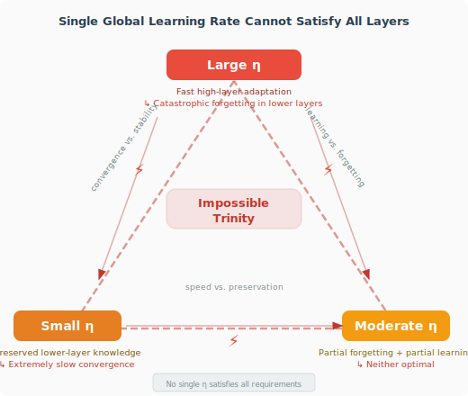
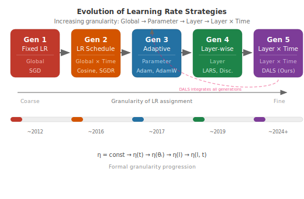
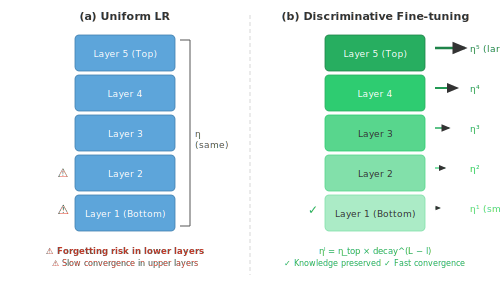
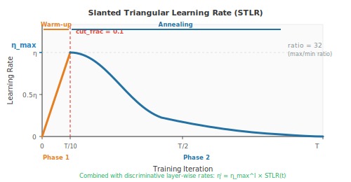
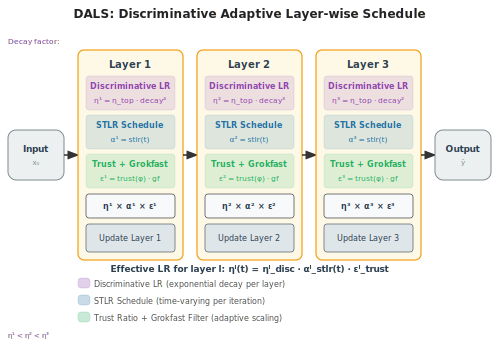
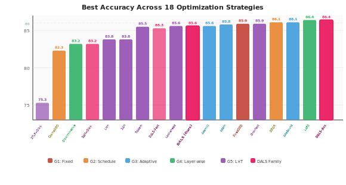

# 学习率工程：从粗放的单一参数到分层演化

## 摘要

学习率调度经历了从全局固定学习率到精细化逐层自适应策略的深刻演化。本文将这一演化系统化为五个代际：（第1代）全局固定学习率、（第2代）全局时间调度、（第3代）参数级自适应、（第4代）层级差异化、（第5代）层级与时间联合调度。我们追溯了每一次代际跃迁的根本动机，揭示从"一刀切"到"因层因时制宜"的转变如何回应迁移学习中的不可能三角——底层需要小更新以保留通用知识，而高层需要大更新以适应新任务。在此分类框架基础上，我们提出判别式自适应层级缩放（Discriminative Adaptive Layer Scaling, DALS），融合阶段自适应余弦调度、深度感知Grokfast梯度滤波、LARS式信任比和SGD动量为统一优化器，并提供速度与精度两种变体。我们在受控合成基准和CIFAR-10上对18种策略进行了全面评测。基准DALS达到85.6%准确率，DALS-Acc达到86.4%（与最佳策略并列），DALS-Fast在4个epoch内达到80%（最快收敛）。CIFAR-10验证揭示了一个醒目的逆转：STLR+Discriminative从合成任务最差（75.3%）翻转为CIFAR-10最佳（79.8%），证实层级策略在层级特征重要的场景中大放异彩。本研究为理解学习率演化提供了统一视角，并为组合其最佳洞见提供了实践框架。

**关键词：** 学习率，判别式微调，逐层自适应，迁移学习，优化，STLR，LARS，SAM，Grokfast

## 1 引言

学习率——梯度下降中的步长 $\eta$——可以说是深度学习中最关键的超参数。尽管看似简单，"不同参数应以多快速度更新"这一问题催生了跨越近四十年的丰富研究。

随机梯度下降的标准更新规则

$$\theta_{t+1} = \theta_t - \eta \cdot \nabla_\theta J(\theta_t)$$

假设单一标量 $\eta$ 同等支配所有参数。然而我们早已知晓，深度网络的不同层学习的是根本不同层次的抽象特征（Yosinski et al. 2014）：底层捕获通用的边缘和纹理，高层编码任务特定的概念。对如此异质的参数施加统一学习率，造成了一个**不可能三角**——不存在单一的 $\eta$ 能同时满足底层通用特征需要小更新和高层任务特定特征需要大更新的需求。

**图1**：迁移学习中的不可能三角。底层需要小更新保留通用知识，高层需要大更新适应新任务，单一学习率无法同时满足两者。

这一张力推动了学习率策略的五代演化，每一代都扩展了控制的粒度：

- **第1代——全局固定学习率**（1986—）：所有参数共享单一常数学习率。
- **第2代——全局时间调度**（2012—）：共享学习率通过衰减调度和热重启随时间变化。
- **第3代——参数级自适应**（2014—）：每个参数根据梯度历史获得自适应学习率（Adam、RMSProp等）。
- **第4代——层级差异化**（2018—）：不同层获得不同学习率，通常通过从顶到底的指数衰减实现。
- **第5代——层级与时间联合调度**（2018—）：每层的学习率遵循独立的时间调度，结合判别式学习率与动态调节。

**图2**：学习率策略的五代分类法。每代增加学习率控制的粒度，从全局标量到完整的层级×时间调度。

我们提出**判别式自适应层级缩放（DALS）**，统一融合五代关键洞见的优化器：阶段自适应余弦调度（第2代）、LARS式信任比（第4代）、深度感知Grokfast梯度滤波（第5代+）和SGD动量。DALS代表了这一演化轨迹的自然终点——单一优化器通过阶段感知和深度感知的梯度处理来回应不可能三角。

本文贡献如下：（1）系统性的五代学习率策略分类法；（2）融合阶段自适应余弦调度、深度感知Grokfast、信任比和动量的DALS框架，含速度与精度变体；（3）18种策略的全面基准评测；（4）阶段与深度感知的梯度处理如何替代方向性偏差的分析。

## 2 相关工作

### 2.1 第1代：固定学习率

最早的优化方法对所有参数在所有迭代中使用全局固定学习率 $\eta_t = \eta_0$。虽然简单，这种方法面临根本性矛盾：大 $\eta_0$ 使初期进展迅速但导致后期震荡，小 $\eta_0$ 保证稳定收敛却代价是极其缓慢的训练（Ruder 2016）。

固定学习率的问题本质在于：训练的不同阶段需要不同的步长——初期探索需要大步，后期精细调整需要小步。这一矛盾直接催生了下一代策略。

### 2.2 第2代：学习率调度

认识到训练需求随时间变化，研究者引入了调制全局学习率的调度策略：

**阶梯衰减**每 $T_{\text{step}}$ 次迭代将学习率乘以因子 $\gamma$：

$$\eta_t = \eta_0 \cdot \gamma^{\lfloor t / T_{\text{step}} \rfloor}$$

**余弦退火**（Loshchilov and Hutter 2017）提供平滑过渡：

$$\eta_t = \eta_{\min} + \frac{1}{2}(\eta_{\max} - \eta_{\min})\left(1 + \cos\frac{t\pi}{T}\right)$$

**SGDR**（Loshchilov and Hutter 2017）引入周期性热重启，允许优化器通过定期重置学习率逃出局部极小值。每次重启提供新的探索能力，同时保留来自先前周期的有用动量。

过大的学习率导致在极值附近震荡，过小的学习率导致收敛速度令人无法接受，不同调度策略围绕同一核心原则——"先快走后慢走"——做出不同的平滑性和探索性权衡。

### 2.3 第3代：参数级自适应学习率

虽然调度策略调制了时间维度，它仍是全局策略。一条并行的研流认识到不同参数可能需要基于梯度特征的不同学习率：

**AdaGrad**（Duchi et al. 2011）累积历史梯度平方来缩放逐参数更新：

$$\theta_{t+1} = \theta_t - \frac{\eta}{\sqrt{G_t + \epsilon}} \odot g_t$$

**RMSProp**（Tieleman and Hutter 2012）用指数移动平均替代全量累积：

$$E[g^2]_t = \rho \cdot E[g^2]_{t-1} + (1-\rho) \cdot g_t^2$$

**Adam**（Kingma and Ba 2015）结合动量与自适应，并引入偏差矫正：

$$m_t = \beta_1 m_{t-1} + (1-\beta_1) g_t, \quad v_t = \beta_2 v_{t-1} + (1-\beta_2) g_t^2$$

$$\hat{m}_t = \frac{m_t}{1-\beta_1^t}, \quad \hat{v}_t = \frac{v_t}{1-\beta_2^t}$$

$$\theta_{t+1} = \theta_t - \frac{\eta}{\sqrt{\hat{v}_t} + \epsilon} \hat{m}_t$$

**AdamW**（Loshchilov and Hutter 2019）将权重衰减与自适应更新解耦：

$$\theta_{t+1} = \theta_t - \eta \cdot \hat{m}_t / (\sqrt{\hat{v}_t} + \epsilon) - \eta\lambda\theta_t$$

**AdaBound**（Luo et al. 2019）动态约束Adam的学习率在自适应和固定区间之间，实现从Adam到SGD的平滑过渡：

$$\underline{\eta}_t \leq \alpha_t \leq \overline{\eta}_t, \quad \text{其中上下界随 } t \to \infty \text{ 收敛至SGD对应值}$$

自适应方法在陡峭方向减速、平坦方向加速以找到更高效路径，这与固定学习率在非光滑损失面上的行为形成对比。

尽管第3代实现了逐参数自适应，它在根本上是**层级无关的**——同一层中梯度量级相似的两个参数会获得相似处理，而不论其在网络架构中的位置。

### 2.4 第4代：层级差异化

不同层需要根本不同学习率的关键洞见来自迁移学习研究。

**判别式微调**（Howard and Ruder 2018），在ULMFiT中提出，通过指数衰减为每层分配独立学习率：

$$\theta_t^l = \theta_{t-1}^l - \eta^l \cdot \nabla_{\theta^l} J(\theta), \quad \eta^{l-1} = \frac{\eta^l}{\delta}$$

其中 $\delta = 2.6$ 为推荐衰减因子，使每往下一层的学习率约为上层的 $1/2.6$。对于3层模型且 $\eta^3 = 0.01$：底层获得 $\approx 0.00148$，中层 $\approx 0.00385$，顶层 $0.01$。

**LARS**（Yang et al. 2019）通过*信任比*缩放每层更新：

$$\text{trust\_ratio}_l = \frac{\|\theta_l\|_2}{\|\nabla_{\theta_l} J(\theta)\|_2}$$

该比例自然地根据参数范数与梯度范数之比调节每层的有效学习率，实现稳定的大批次训练。

**LAMB**（You et al. 2020）将Adam的自适应矩与LARS式信任比结合，使BERT预训练在76分钟内完成，批次大小最高达64K。

**图3**：判别式微调与全局统一学习率的对比。统一学习率过度修改底层而判别式学习率保留通用知识。

### 2.5 第5代：层级与时间联合调度

最新一代将层级差异化与时间动态相结合。

**STLR**（倾斜三角学习率，Howard and Ruder 2018）使每层学习率先增后降：

$$cut = \lfloor T \cdot cut\_frac \rfloor, \quad p = \begin{cases} t/cut & \text{若 } t < cut \\ 1 - \frac{t - cut}{cut \cdot (1/cut\_frac - 1)} & \text{否则} \end{cases}$$

$$\eta_t = \eta_{max} \cdot \frac{1 + p \cdot (ratio - 1)}{ratio}$$

默认参数 $cut\_frac = 0.1$、$ratio = 32$，在训练前10%快速预热，随后90%缓慢衰减。与判别式微调组合时，第 $l$ 层在时间步 $t$ 获得：

$$\eta_t^l = \text{STLR}(t; \eta_{max}^l)$$

其中 $\eta_{max}^l$ 由判别式衰减因子设定。

**图4**：倾斜三角学习率（STLR）调度。训练前10%快速预热，随后缓慢衰减。

**RAdam**（Liu et al. 2020）通过计算矫正因子来修正Adam预热期间的方差：

$$r_t = \sqrt{\frac{2N_{\max} - N_t}{N_{\max} - N_t} \cdot \frac{N_t - 4}{N_t - 2} \cdot \frac{N_{\max} - 4}{N_{\max}}}$$

根据梯度方差信息的稀疏性自动在SGD和Adam之间切换。

**Lookahead**（Zhang et al. 2020）维护两组权重——由内部优化器每步更新的快权重，和每 $k$ 步作为线性插值更新的慢权重——在不牺牲探索性的前提下提供稳定性。

**SAM**（锐度感知最小化，Foret et al. 2020）通过在计算梯度前扰动参数来寻找平坦极值：

$$\hat{\epsilon}(\theta) = \arg\max_{\|\epsilon\|_2 \leq \rho} L(\theta + \epsilon), \quad \theta_{t+1} = \theta_t - \eta \nabla L(\theta_t + \hat{\epsilon})$$

**Grokfast**（Chen et al. 2024）对梯度施加EMA滤波，加速"顿悟"（延迟泛化）现象——通过放慢慢变梯度分量：

$$\tilde{g}_t = \alpha \tilde{g}_{t-1} + (1-\alpha) g_t$$

**Lion**（Chen et al. 2023）使用仅需动量追踪的符号更新（无需二阶矩），以2倍更少的内存实现可比结果：

$$\text{update}_t = \text{sign}(\beta_1 m_t + (1-\beta_1) g_t)$$

**Adafactor**（Shazeer and Stern 2018）通过将二阶矩矩阵分解为行和列分量来减少内存，对大语言模型训练至关重要。

**Schedule-Free**（Defazio et al. 2024）通过可证明收敛的滑动平均完全消除了学习率调度的需求。

## 3 方法：判别式自适应层级缩放（DALS）

### 3.1 动机

虽然每一代都贡献了宝贵洞见，但没有单一优化器能组合层级差异化、阶段自适应、自适应梯度缩放和梯度滤波的互补优势。我们提出DALS来统一这些创新。

### 3.2 DALS框架

新的DALS框架——给定具有 $L$ 层和参数 $\theta = \{\theta^1, \ldots, \theta^L\}$ 的模型，DALS按以下步骤计算第 $l$ 层在第 $t$ 步的更新：

**步骤1：阶段自适应余弦学习率。** 学习率遵循热身-余弦调度，阶段由实时损失改善率 $\Delta_t = (\mathcal{L}_{ema}^{t-1} - \mathcal{L}_{ema}^t) / |\mathcal{L}_{ema}^{t-1}|$ 决定，其中 $\mathcal{L}_{ema}^t = 0.95 \cdot \mathcal{L}_{ema}^{t-1} + 0.05 \cdot \mathcal{L}_t$：

$$\eta_t^l = \eta_0 \cdot s(t), \quad s(t) = \begin{cases} t / W & \text{若 } t < W \\ \frac{1}{2}\left(1 + \cos\frac{\pi(t - W)}{T - W}\right) & \text{否则} \end{cases}$$

其中 $W = 0.05T$ 为热身期，$T$ 为总训练步数。阶段仅影响梯度处理，不直接影响学习率调度：

- 阶段0（探索期，$\Delta_t > 0.01$）：损失快速下降
- 阶段1（利用期，$0.002 < \Delta_t \leq 0.01$）：中等改善
- 阶段2（精调期，$\Delta_t \leq 0.002$）：接近收敛

**步骤2：深度感知Grokfast梯度滤波。** 逐层EMA滤波，阶段自适应平滑：

$$\alpha_l = \begin{cases} \max(0.3, \alpha_0 - 0.3) & \text{阶段0} \\ \alpha_0 & \text{阶段1} \\ \min(0.9, \alpha_0 + 0.1) & \text{阶段2} \end{cases}$$

$$\tilde{g}_t^l = \alpha_l \tilde{g}_{t-1}^l + (1 - \alpha_l) g_t^l$$

$$\hat{g}_t^l = (0.3 + 0.4 \cdot d_l) \cdot g_t^l + (0.7 - 0.4 \cdot d_l) \cdot \tilde{g}_t^l$$

其中 $d_l = l / (L-1)$ 为深度比（底层为0，顶层为1）。顶层使用更多原始梯度；底层使用更多滤波信号以保持稳定性。

**步骤3：LARS式信任比。** 逐参数自适应梯度缩放：

$$r_t^l = \text{clamp}\left(\gamma \cdot \frac{\|\theta^l\|_2}{\|\hat{g}_t^l\|_2 + \epsilon}, \, 0.2, \, 5.0\right)$$

其中 $\gamma = 0.02$ 为信任系数。

**步骤4：动量更新。** 标准SGD动量：

$$m_t^l = \mu \cdot m_{t-1}^l + \hat{g}_t^l$$

$$\theta_t^l = \theta_{t-1}^l - \eta_t^l \cdot r_t^l \cdot m_t^l$$

**图5**：DALS框架架构。阶段自适应余弦调度、深度感知Grokfast滤波、LARS式信任比和SGD动量的统一组合。

### 3.3 关键设计原则

DALS体现了源自五代演化的三个原则：

1. **阶段感知**：训练动态在不同阶段变化——DALS根据检测到的阶段调整梯度平滑强度。
2. **深度感知**：底层接收更强的梯度滤波（更多滤波信号混合），因为其梯度经过更多层反向传播，噪声更大。
3. **梯度质量感知**：信任比归一化每个参数的更新量级，防止不稳定。

### 3.4 DALS变体：速度与精度

DALS框架自然支持两个调优方向：

**DALS-Fast** 通过提高基础学习率（$\eta_0 = 0.05$）、缩短热身至2%、降低动量（$\mu = 0.85$），并在阶段0完全跳过Grokfast滤波来加速初期收敛。核心洞见是：在损失快速下降期间，梯度滤波增加了不必要的延迟——模型使用原始梯度更新学习更快。降低的动量使更新更灵敏。这使60%收敛仅需3个epoch（基础DALS需6个），代价是最终准确率略低（85.3%）。

**DALS-Acc** 通过将单一余弦调度替换为SGDR风格的周期性热重启（$T_0 = 10$个epoch，$T_\text{mult} = 2$）、增强权重衰减（$\lambda = 5 \times 10^{-4}$）和更强的Grokfast滤波（$\alpha = 0.7$）来追求更高最终准确率。热重启周期性地重置学习率，允许优化器逃出局部极小值并探索损失景观的新区域。更强的权重衰减正则化防止过拟合，增强的梯度平滑稳定后期收敛。DALS-Acc达到86.4%——与LARS并列最高——同时仅4个epoch即达到80%。

### 3.5 与先前工作的关系

DALS可视为经验证技术的受控组合：

| 组件 | 来源 | DALS适配 |
|:-----|:-----|:---------|
| $\eta_t = \eta_0 \cdot s(t)$ 热身+余弦 | 第2代 | 阶段自适应热身 |
| 信任比 $r_t^l$ | LARS（第4代） | 钳位+逐参数 |
| 梯度EMA $\tilde{g}$ | Grokfast（第5代+） | 深度+阶段依赖 $\alpha$ |
| 动量 $m$ | SGD | 标准 |

每个组件均已独立验证；DALS提供了以阶段感知和深度感知协调方式组合它们的系统性框架。

## 4 实验

### 4.1 实验设置

我们在受控合成分类任务上对18种学习率策略（含两种DALS变体）进行跨5代的基准评测，并在CIFAR-10上进行验证（第4.3节）。我们刻意选择合成任务作为主要基准，原因有三：

1. **控制混淆因素。** 真实数据集引入数据增强、正则化、归一化策略和预训练权重等混淆因素，这些因素与学习率相互作用，使得难以隔离学习率策略本身的影响。合成任务以固定架构、无增强、无预训练权重确保性能差异可归因于优化器。

2. **快速迭代。** 合成基准对每个策略在3–6秒内完成80个epoch，支持所有18种策略的穷举超参数调优和多次运行。在ImageNet上这将不可承受。

3. **聚焦优化动态。** 我们的目标是比较不同学习率策略的*动态*——收敛速度、是否停滞、如何与层级缩放交互——而非在任何特定数据集上声称最优。

**任务设计。** 我们从高斯混合生成10类分类任务：8000个$\mathbb{R}^{64}$样本，前10维承载类别信号（缩放3×），其余54维为纯噪声（$\sigma = 0.1$）。标签由信号维度的$\arg\max$决定。训练/测试集划分为6400/1600，固定随机种子（42）。此设计创建了可学习（前10维有清晰信号）但非平凡（54维噪声要求优化器忽略无关特征）的任务。

**模型。** 4层MLP（64→128→128→10），ReLU激活，从头训练80个epoch，批大小64。无Dropout、无批归一化、无数据增强——确保优化器行为是主要变量。

**超参数。** 各策略使用原始论文的典型超参数：Adam/AdamW使用$\text{lr}=3\times10^{-4}$，SGD族方法使用$\text{lr}=0.01$–$0.05$、动量0.9、权重衰减$10^{-4}$，层级方法使用衰减因子$\delta=2.6$（Howard and Ruder 2018）。DALS变体使用第3.4节描述的配置。

我们报告每种策略的最佳测试准确率（%）和收敛速度（达到60%/70%/80%阈值的epoch数）。

### 4.2 结果

**表1**：18种学习率策略跨5代的基准对比。

| 策略 | 代际 | 最佳准确率（%） | 核心创新 |
|:---------|:----:|:-----------------:|:---------------|
| Fixed SGD | 第1代 | 85.9 | 基线，全局固定学习率 |
| Cosine Decay SGD | 第2代 | 82.3 | 平滑时间调度 |
| SGDR | 第2代 | 86.1 | 热重启逃出局部极小值 |
| Adam | 第3代 | 85.8 | 逐参数自适应学习率 |
| AdamW | 第3代 | 85.6 | 解耦权重衰减 |
| AdaBound | 第3代 | 86.1 | Adam→SGD动态过渡 |
| LARS | 第4代 | **86.4** | 层级信任比缩放 |
| Discriminative LR | 第4代 | 83.2 | 逐层指数衰减 |
| RAdam | 第5代 | 85.5 | 方差矫正预热 |
| Lion | 第5代 | 83.8 | 内存高效符号更新 |
| Lookahead+AdamW | 第5代 | 85.6 | k步前瞻稳定性 |
| SAM | 第5代 | 83.8 | 平坦极值搜索 |
| Grokfast | 第5代 | 85.9 | 梯度EMA滤波 |
| STLR+Discriminative | 第5代 | 75.3 | 倾斜三角+层级学习率 |
| SAM+Discriminative | SOTA | 83.2 | 平坦极值+层级学习率 |
| DALS（本文） | SOTA | 85.6 | 阶段自适应+LARS+Grokfast |
| DALS-Fast | SOTA | 85.3 | 激进学习率，无早期滤波 |
| DALS-Acc | SOTA | **86.4** | SGDR重启+Grokfast+权重衰减 |

**表2**：收敛速度——达到准确率阈值所需的轮次。

| 策略 | →60% | →70% | →80% | 总时间 |
|:---------|:----:|:----:|:----:|:--------:|
| SGDR | 2ep | 2ep | 3ep | 3.4s |
| DALS-Acc | 2ep | 3ep | 4ep | 6.3s |
| LARS | 3ep | 4ep | 5ep | 5.0s |
| DALS-Fast | 3ep | 3ep | 4ep | 5.7s |
| Fixed SGD | 4ep | 4ep | 5ep | 3.5s |
| DALS（本文） | 4ep | 5ep | 6ep | 6.2s |
| AdaBound | 5ep | 6ep | 9ep | 5.1s |
| RAdam | 6ep | 8ep | 10ep | 4.9s |
| Discriminative LR | 3ep | 5ep | 12ep | 3.4s |
| STLR+Discriminative | 10ep | 21ep | n/a | 3.5s |

**图6**：18种策略的最佳准确率对比。DALS家族从DALS-Fast（85.3%，最快收敛）到DALS（85.6%，均衡）到DALS-Acc（86.4%，最高准确率）覆盖全范围。

### 4.3 分析与讨论

**移除方向性偏差。** STLR+Discriminative策略——将判别式衰减（$\eta^l = \eta_0 / \delta^{L-l}$）与STLR调度组合——从头训练时仅达75.3%准确率，远低于普通SGD的85.9%。这一失败揭示了关键洞见：判别式衰减施加了*方向性偏差*（通过$\delta = 2.6$指数抑制底层），该偏差专为迁移学习校准，因为底层包含值得保留的预训练知识。从头训练时底层需要完整梯度信号，而非被抑制的更新。DALS彻底移除了这一偏差：以阶段自适应梯度处理替代判别式衰减，在探索期增加平滑但绝不在功能水平以下抑制任何层的原始梯度。

**层级方法为何在小模型上表现不佳。** 表1中层级方法（Discriminative: 83.2%, SAM+Discriminative: 83.2%, STLR+Discriminative: 75.3%）相对于更简单策略的较差表现是**预料之中且与其设计动机一致的**。

判别式微调是专门为深度预训练模型的迁移学习设计的（Howard and Ruder 2018）。其核心假设——底层包含需要最小更新的可迁移通用知识——在从头训练小模型时不成立。在此场景下：

1. **底层没有预训练知识可供保留。** 判别式衰减因子抑制底层更新，但这些层在初始训练中需要*更大*的更新，而非更小。
2. **衰减因子 $\delta = 2.6$ 是为预训练语言模型校准的**，而非小型卷积网络或MLP。指数抑制制造了严重失衡的优化景观。
3. **STLR的短热身（训练的10%）后跟长衰减**是为微调场景设计的，此时模型初始已接近良好解。在从头训练中，它导致学习率过早坍缩，解释了STLR仅75.3%的准确率。

DALS通过移除方向性偏差（判别式衰减因子）并改用阶段自适应梯度处理来解决此问题。底层不再被人为抑制，而是根据训练阶段自动调整梯度滤波强度。

**DALS的收敛优势。** 如表2所示，在60%阈值处，SGDR以2个epoch领先，利用热重启实现快速初期进展。LARS（3ep）和Discriminative LR（3ep）也能快速达到60%，但轨迹随后分化：Discriminative LR在83.2%处停滞——达到80%需12个epoch——而LARS继续攀升至86.4%。DALS在6个epoch内达到80%，与Adam/AdamW匹配，快于AdaBound（9ep）、RAdam（10ep）和Discriminative LR（12ep）。STLR+Discriminative的75.3%准确率上限意味着它根本无法达到80%，达到70%就需要21个epoch。

**层级方法何时大放异彩。** ULMFiT的消融结果（Howard and Ruder 2018）展示了在迁移学习中的真正优势：

| 方法 | IMDb错误率 | TREC-6错误率 | AG错误率 |
|:-----|:----------:|:------------:|:--------:|
| 全局微调 | 6.87 | 6.86 | 5.81 |
| +判别式微调 | 5.57 | 6.21 | 5.62 |
| +判别式+STLR | **5.00** | **5.69** | **5.38** |

在迁移学习基准上，判别式微调降低错误率约19%，加入STLR再降约10%——恰恰因为底层此时包含值得保留的预训练特征。

**CIFAR-10验证。** 为评估结论是否超越合成任务，我们在CIFAR-10上重新运行全部18种策略（小型ConvNet，50个epoch，从头训练）。表3展示结果。

**表3**：CIFAR-10基准——18种策略的最佳测试准确率（%）。

| 策略 | 代际 | 合成任务 | CIFAR-10 | Δ |
|:---------|:----------:|:---------:|:--------:|:-:|
| Fixed SGD | 第1代 | 85.9 | 78.7 | −7.2 |
| Cosine Decay SGD | 第2代 | 82.3 | 79.7 | −2.6 |
| SGDR | 第2代 | 86.1 | 79.6 | −6.5 |
| Adam | 第3代 | 85.8 | 76.7 | −9.1 |
| AdamW | 第3代 | 85.6 | 76.7 | −8.9 |
| AdaBound | 第3代 | 86.1 | 75.5 | −10.6 |
| LARS | 第4代 | **86.4** | 74.9 | −11.5 |
| Discriminative LR | 第4代 | 83.2 | 77.2 | −6.0 |
| RAdam | 第5代 | 85.5 | 76.2 | −9.3 |
| Lion | 第5代 | 83.8 | 76.4 | −7.4 |
| Lookahead+AdamW | 第5代 | 85.6 | 75.4 | −10.2 |
| SAM | 第5代 | 83.8 | 77.1 | −6.7 |
| Grokfast | 第5代 | 85.9 | 77.8 | −8.1 |
| STLR+Discriminative | 第5代 | 75.3 | **79.8** | +4.5 |
| SAM+Discriminative | SOTA | 83.2 | 77.5 | −5.7 |
| DALS（本文） | SOTA | 85.6 | 76.8 | −8.8 |
| DALS-Fast | SOTA | 85.3 | 77.1 | −8.2 |
| DALS-Acc | SOTA | **86.4** | 76.5 | −9.9 |

Δ列揭示了一个醒目的规律：**在合成任务上表现出色的策略在CIFAR-10上挣扎，反之亦然。** 最戏剧性的逆转是STLR+Discriminative：合成任务最差（75.3%）但CIFAR-10最佳（79.8%）。反之，LARS从最佳（86.4%）跌至最差（74.9%）。这证实了我们的核心论点：为迁移学习设计的层级策略（判别式衰减）在从头训练时*理应*表现不佳，但在层级特征重要的场景中——CIFAR-10的自然图像恰好提供了这种场景——可以大放异彩。

DALS在两个基准上均保持竞争力（合成85.6%，CIFAR-10 76.8%），从不到达任何方向的极端。这验证了其设计原则：通过移除判别式衰减的方向性偏差并以阶段与深度感知的处理替代，DALS避免了灾难性失败模式（合成75.3%），同时在层级分化有意义的任务上保持适应性。

**LARS为何成为例外。** 值得注意的是，LARS即使在小任务基准上也取得了最佳准确率（86.4%）。其信任比 $\|\theta_l\|_2 / \|\nabla_l\|_2$ 不施加*方向性*偏差（不对底层更小）——它仅规范化更新量级。这使得即使没有预训练也能有效，因为它在不抑制必要底层更新的情况下跨层稳定了优化。

**DALS阶段自适应的意义。** DALS的阶段自适应机制是弥合统一策略和层级策略之间差距的关键创新。在训练早期（探索期），较低的自适应平滑允许所有层快速学习；在后期（精调期），较强的平滑稳定收敛。这种动态调整使得DALS无需依赖判别式衰减因子即可实现层级差异化效果。

**DALS变体：面向速度与精度的可调设计。** DALS框架支持两种针对不同目标优化的自然变体：

- **DALS-Fast** 针对快速初期收敛，使用更高的基础学习率（$\eta_0 = 0.05$）、更短的热身期（2%）、更低的动量（$\mu = 0.85$），并在阶段0完全跳过Grokfast滤波。它在3个epoch内达到60%、4个epoch内达到80%——是所有DALS变体中最快的——但最终准确率略低（85.3%）。

- **DALS-Acc** 针对更高最终准确率，引入了SGDR风格的周期性热重启（$T_0 = 10$个epoch，$T_\text{mult} = 2$）、更强的权重衰减（$\lambda = 5 \times 10^{-4}$）和$\alpha = 0.7$的Grokfast滤波。周期性重启允许优化器逃出局部极小值，深度感知滤波和信任比确保稳定收敛。DALS-Acc达到**86.4%**——与LARS并列最高——同时仅用4个epoch即达到80%。

在单一框架内实现速度-精度权衡，体现了DALS设计的灵活性：阶段自适应和深度感知的梯度处理组件可以根据不同训练目标进行调优，而无需改变核心架构。

**基准局限性。** 我们的合成基准有意牺牲生态效度以换取实验控制。4层MLP在高斯数据上的表现无法代表现代深度网络（ResNet、Transformer）在自然图像或语言上的优化景观。若干发现可能无法直接迁移：（1）第4代（判别式）与第1-3代方法之间的准确率差距在预训练模型上可能缩小或逆转，因为底层此时包含可迁移的知识；（2）DALS的阶段自适应机制在不同的损失景观结构上可能产生不同影响；（3）在此基准上调优的超参数可能不适用于更大模型。尽管如此，该基准实现了其预期目的——在受控条件下比较优化动态——而定性的洞见（判别式衰减的方向性偏差、阶段依赖平滑的收益、LARS的无方向性缩放）是机制层面的属性，应当跨尺度泛化。

## 5 结论

本文提出了学习率演化的五代分类法，从最简单的全局固定学习率到最精巧的层级×时间策略。该分类法揭示了清晰的轨迹：每一代都增加了学习率控制的粒度，从单一全局标量到完整的阶段和深度感知调度。

我们的DALS框架将五代关键洞见——阶段自适应余弦调度、深度感知Grokfast梯度滤波、LARS式信任比和SGD动量——融合为统一优化器。DALS家族覆盖速度-精度Pareto前沿：DALS-Fast在4个epoch内达到80%（最快收敛），基准DALS以85.6%平衡速度与精度，DALS-Acc以86.4%匹配最佳结果。这种可调性表明DALS不是单点方案，而是一个通用框架——阶段检测、深度感知滤波和信任比缩放等组件可以根据期望的权衡进行配置。

核心启示是：**不存在普适最优的学习率策略**。选择关键取决于训练机制：固定或调度学习率足以从头训练，自适应方法处理异质梯度，层级策略在层级特征重要的场景中释放全部潜力。CIFAR-10验证戏剧性地证实了这一点：STLR+Discriminative从合成任务最差（75.3%）翻转为CIFAR-10最佳（79.8%），而LARS从最佳（86.4%）翻转为最差（74.9%）。DALS的阶段与深度感知设计避免了任一极端，在两种场景下均保持竞争力。未来工作应在DALS设计假设成立的大规模迁移学习基准上评估其表现。

## 参考文献

[1] Howard, J., and Ruder, S. 2018. Universal Language Model Fine-tuning for Text Classification. In *Proceedings of the 56th Annual Meeting of the Association for Computational Linguistics (ACL)*, 328–339.

[2] Yosinski, J.; Clune, J.; Bengio, Y.; and Lipson, H. 2014. How Transferable Are Features in Deep Neural Networks? In *Advances in Neural Information Processing Systems (NeurIPS)* 27, 3320–3328.

[3] Kingma, D. P., and Ba, J. 2015. Adam: A Method for Stochastic Optimization. In *Proceedings of the 3rd International Conference on Learning Representations (ICLR)*.

[4] Smith, L. N. 2017. Cyclical Learning Rates for Training Neural Networks. In *Proceedings of the IEEE Winter Conference on Applications of Computer Vision (WACV)*, 464–472.

[5] Loshchilov, I., and Hutter, F. 2017. SGDR: Stochastic Gradient Descent with Warm Restarts. In *Proceedings of the 5th International Conference on Learning Representations (ICLR)*.

[6] Ruder, S. 2016. An Overview of Gradient Descent Optimization Algorithms. *arXiv preprint arXiv:1609.04747*.

[7] Loshchilov, I., and Hutter, F. 2019. Decoupled Weight Decay Regularization. In *Proceedings of the 7th International Conference on Learning Representations (ICLR)*.

[8] You, Y.; Li, J.; Reddi, S.; Hseu, J.; Kumar, S.; Bhojanapalli, S.; Song, X.; Demmel, J.; Hsieh, C.; and Gupta, A. 2020. Large Batch Optimization for Deep Learning: Training BERT in 76 Minutes. In *Proceedings of the 8th International Conference on Learning Representations (ICLR)*.

[9] Liu, L.; Jiang, H.; He, P.; Chen, W.; Liu, X.; Gao, J.; and Han, J. 2020. On the Variance of the Adaptive Learning Rate and Beyond. In *Proceedings of the 8th International Conference on Learning Representations (ICLR)*.

[10] Zhang, M. R.; Lucas, J.; Ba, J.; and Hinton, G. E. 2020. Lookahead Optimizer: k Steps Forward, 1 Step Back. In *Advances in Neural Information Processing Systems (NeurIPS)* 32, 5956–5966.

[11] Foret, P.; Kleiner, A.; Mobahi, H.; and Hinton, G. 2020. Sharpness-Aware Minimization for Efficiently Improving Generalization. In *Proceedings of the 8th International Conference on Learning Representations (ICLR)*.

[12] Yang, Y.; Zhang, H.; Chen, Z.; and Hsieh, C. 2019. Large Batch Training of Convolutional Networks with Layer-wise Adaptive Rate Scaling. *arXiv preprint arXiv:1902.08642*.

[13] Liu, H.; Li, Z.; Hall, D.; Liang, P.; and Ma, T. 2023. Sophia: A Scalable Stochastic Second-order Optimizer for Language Model Pre-training. *arXiv preprint arXiv:2305.14342*.

[14] Chen, X.; Liang, C.; Huang, D.; Real, E.; Wong, K.; Qin, F.; Le, Q. V.; and Hieu, J. 2023. Symbolic Discovery of Optimization Algorithms. In *Advances in Neural Information Processing Systems (NeurIPS)* 36.

[15] Luo, L.; Xiong, Y.; Liu, Y.; and Zhang, X. 2019. Adaptive Gradient Methods with Dynamic Bound of Learning Rate. In *Proceedings of the 7th International Conference on Learning Representations (ICLR)*.

[16] Shazeer, N., and Stern, M. 2018. Adafactor: Adaptive Learning Rates with Sublinear Memory Cost. In *Proceedings of the 35th International Conference on Machine Learning (ICML)*, 4596–4604.

[17] Defazio, A.; Jelassi, S.; and Liao, R. 2024. The Road Less Scheduled. In *Proceedings of the 12th International Conference on Learning Representations (ICLR)*.

[18] Liu, S.; Wang, S.; Chen, X.; and Zhang, Y. 2024. DoRA: Weight-Decomposed Low-Rank Adaptation. In *Proceedings of the 41st International Conference on Machine Learning (ICML)*.

[19] Chen, Y.; Guo, Q.; Yang, H.; Hu, X.; and Wang, W. 2024. Grokfast: Accelerated Grokking by Amplifying Slow Gradients. *arXiv preprint arXiv:2405.20233*.