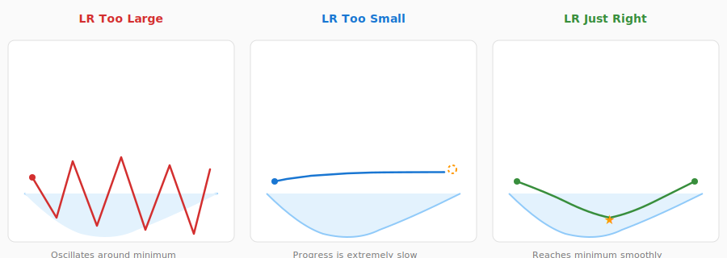
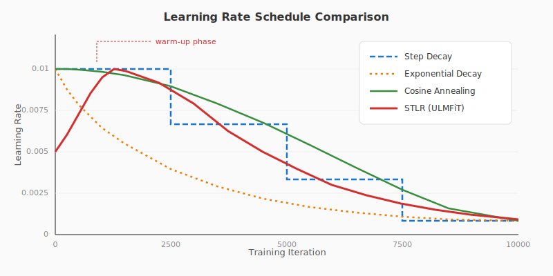
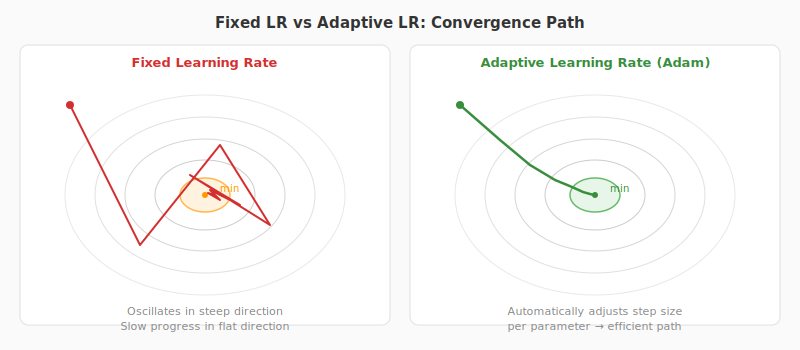
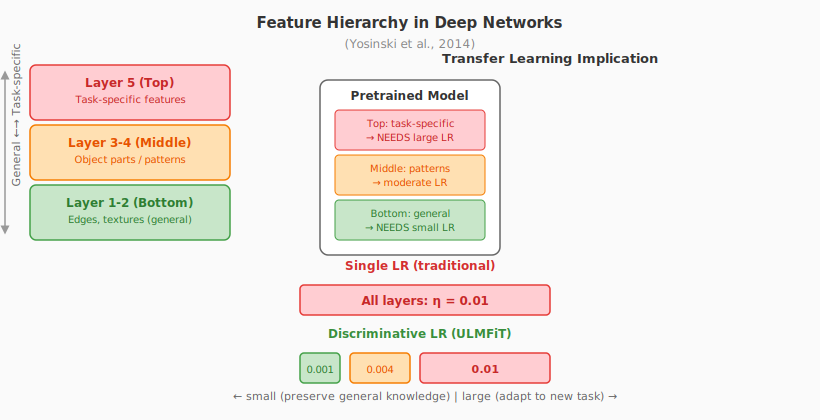
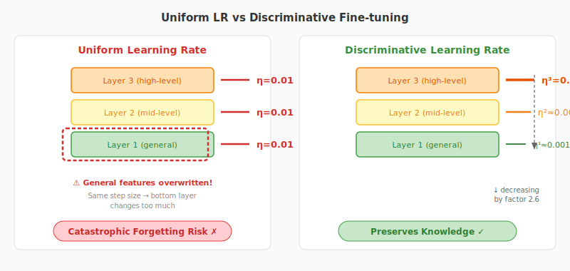
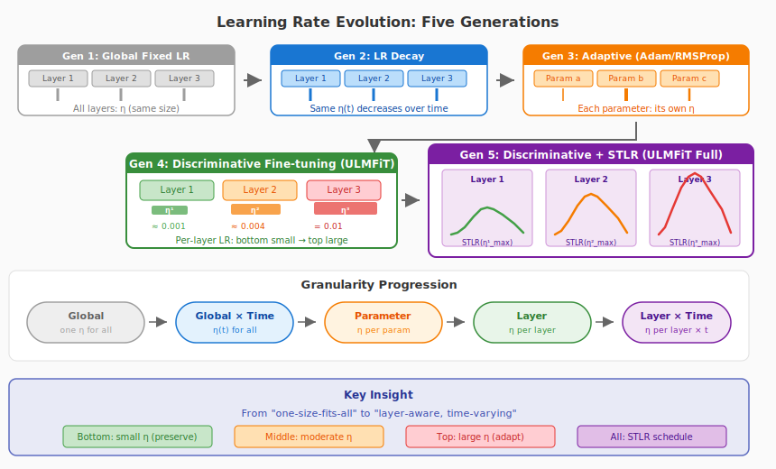
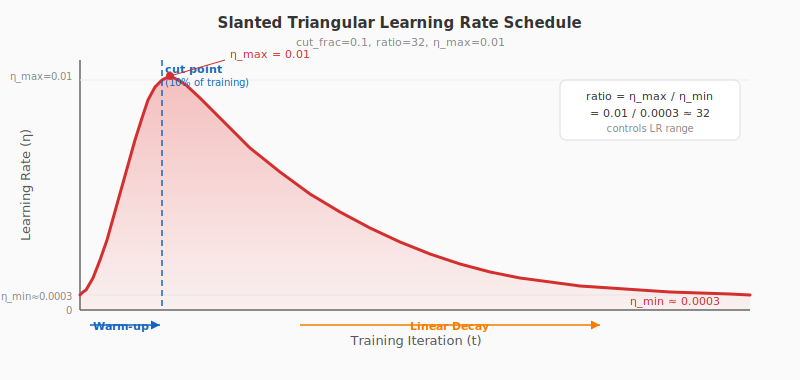
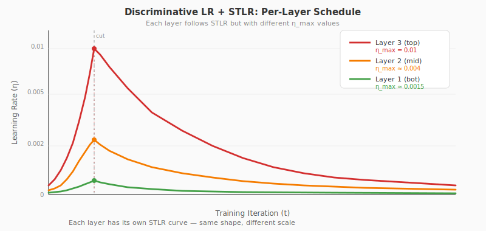

# 学习率的前世今生：从全局单一到逐层定制

> 从随机梯度下降到判别式微调，学习率如何一步步走向"因层制宜"？

---

## 1. 什么是学习率？

训练神经网络，本质上是**在参数空间中寻找最低点**——让损失函数 $J(\theta)$ 尽可能小。这个过程就像一个人蒙着眼睛下山：

> 每一步迈多大？这个"步幅"，就是**学习率（Learning Rate, $\eta$）**。

数学上，最朴素的梯度下降更新规则是这样的：

$$\theta_{t+1} = \theta_t - \eta \cdot \nabla_\theta J(\theta_t)$$

其中：
- $\theta_t$ 是第 $t$ 步的参数
- $\nabla_\theta J(\theta_t)$ 是损失函数对参数的梯度（下坡方向）
- $\eta$ 是学习率（步幅）



**图 1：学习率的直觉——太大则震荡，太小则爬行。** 左图学习率过大，在谷底来回震荡；中图学习率过小，进度缓慢；右图学习率恰当，稳步到达谷底。

学习率的选择直接决定了训练的成败。Andrew Ng 曾用一张经典图说明：学习率太大导致发散，太小导致训练极慢。这看似简单的超参数，却是深度学习中最重要也最难调的一个。

---

## 2. 学习率简史：从固定到动态

### 2.1 第一代：固定学习率（Fixed LR）

最早的 SGD 使用一个**全局固定的学习率**，从头到尾不变：

$$\eta_t = \eta_0 \quad \forall\, t$$

代码很简洁：

```python
# Fixed learning rate SGD
lr = 0.01  # 全局固定学习率
for epoch in range(num_epochs):
    for x, y in dataloader:
        loss = model(x, y)
        loss.backward()
        for param in model.parameters():
            param.data -= lr * param.grad
```

**问题很明显**：训练初期需要大步探索，后期需要小步精调。固定学习率无法兼顾这两个需求。

### 2.2 第二代：学习率衰减（LR Decay）

人们很快想到：让学习率随时间**逐渐变小**。

常见的衰减策略：

| 策略 | 公式 | 特点 |
|:---|:---|:---|
| 阶梯衰减 | $\eta_t = \eta_0 \cdot \gamma^{\lfloor t / T_{\text{step}} \rfloor}$ | 每 $T_{\text{step}}$ 步乘以 $\gamma$ |
| 指数衰减 | $\eta_t = \eta_0 \cdot e^{-kt}$ | 连续平滑衰减 |
| 余弦退火 | $\eta_t = \eta_{\min} + \frac{1}{2}(\eta_{\max} - \eta_{\min})(1 + \cos\frac{t\pi}{T})$ | 平滑过渡，周期性 |
| $1/t$ 衰减 | $\eta_t = \eta_0 / (1 + kt)$ | 理论保证收敛 |

```python
# Step decay
def get_lr(epoch, init_lr=0.01, gamma=0.1, step_size=30):
    return init_lr * (gamma ** (epoch // step_size))

# Cosine annealing
import math
def cosine_lr(epoch, T, eta_min=1e-5, eta_max=0.01):
    return eta_min + 0.5 * (eta_max - eta_min) * (1 + math.cos(math.pi * epoch / T))
```



**图 2：不同学习率调度策略的对比。** 阶梯衰减跳跃式下降；指数衰减连续但陡峭；余弦退火平滑过渡。每种策略都在"训练初期快走、后期慢走"这个核心思想上做文章。

### 2.3 第三代：自适应学习率（Adaptive LR）

衰减策略虽然有效，但有一个根本问题：**所有参数共享同一个学习率**。

2012-2015 年间，一批革命性的优化器出现了——它们为**每个参数**计算不同的学习率：

**AdaGrad（2011）**：累计历史梯度平方，自适应缩放

$$\theta_{t+1} = \theta_t - \frac{\eta}{\sqrt{G_t + \epsilon}} \odot g_t$$

**RMSProp（2012）**：用指数移动平均替代全量累计

$$E[g^2]_t = \rho \cdot E[g^2]_{t-1} + (1-\rho) \cdot g_t^2$$

$$\theta_{t+1} = \theta_t - \frac{\eta}{\sqrt{E[g^2]_t + \epsilon}} \odot g_t$$

**Adam（2015）**：结合动量和自适应，成为最流行的优化器

$$m_t = \beta_1 m_{t-1} + (1 - \beta_1) g_t$$

$$v_t = \beta_2 v_{t-1} + (1 - \beta_2) g_t^2$$

$$\theta_{t+1} = \theta_t - \frac{\eta}{\sqrt{\hat{v}_t} + \epsilon} \hat{m}_t$$

```python
# Simplified Adam optimizer
class Adam:
    def __init__(self, params, lr=0.001, betas=(0.9, 0.999)):
        self.lr = lr
        self.beta1, self.beta2 = betas
        self.m = [torch.zeros_like(p) for p in params]  # 1st moment
        self.v = [torch.zeros_like(p) for p in params]  # 2nd moment
    
    def step(self, params, grads, t):
        for i, (param, grad) in enumerate(zip(params, grads)):
            self.m[i] = self.beta1 * self.m[i] + (1 - self.beta1) * grad
            self.v[i] = self.beta2 * self.v[i] + (1 - self.beta2) * grad**2
            m_hat = self.m[i] / (1 - self.beta1**t)   # bias correction
            v_hat = self.v[i] / (1 - self.beta2**t)   # bias correction
            param.data -= self.lr * m_hat / (v_hat.sqrt() + 1e-8)
```



**图 3：自适应学习率 vs 固定学习率。** 自适应方法（右）在梯度大的方向减速，梯度小的方向加速，从而走出更高效的路径到达最优点。固定学习率（左）则可能在不平坦的损失面上走弯路。

**关键进步**：自适应优化器实现了 **参数级** 的学习率差异化，但它们**没有考虑一个重要维度——层（Layer）**。

---

## 3. 问题的根源：为什么不同层需要不同学习率？

### 3.1 深度网络的层，学的东西不一样

Yosinski et al. (2014) 的经典实验揭示了一个重要事实：

> **深度网络的不同层捕获不同层次的特征——底层捕获通用特征，高层捕获任务特定特征。**



**图 4：深度网络各层学习的特征层次。** 底层（Layer 1-2）学习边缘、纹理等通用特征，与任务关系不大；中层（Layer 3-4）学习部件和模式；顶层（Layer 5）学习与任务直接相关的高级概念。

这一发现对迁移学习至关重要：

- **底层特征更通用**，不需要大幅修改
- **高层特征更特定**，需要更多调整

### 3.2 全局单一学习率的问题

想象一个迁移学习场景：用 ImageNet 预训练模型微调到医学影像任务。

如果所有层共享学习率 $\eta$：

| 学习率设置 | 底层（通用特征） | 高层（任务特定） | 结果 |
|:---|:---|:---|:---|
| $\eta$ 太大 | 通用特征被破坏 | 学习速度快 | 灾难性遗忘 |
| $\eta$ 太小 | 通用特征保留 | 学习速度太慢 | 收敛极慢 |
| $\eta$ 适中 | 部分破坏 | 部分学习 | 两头不讨好 |

这就是**不可能三角**：不存在一个全局学习率，能同时满足底层"小改"、高层"大改"的需求。

---

## 4. 判别式微调：每层一个学习率

### 4.1 核心思想

ULMFiT 论文提出的**判别式微调（Discriminative Fine-tuning）**，核心思想极其简洁：

> **让每一层拥有自己的学习率，底层小、高层大。**

形式化地说，将模型参数按层分组 $\theta = \{\theta^1, \theta^2, \ldots, \theta^L\}$，每层有独立的学习率：

$$\theta_t^l = \theta_{t-1}^l - \eta^l \cdot \nabla_{\theta^l} J(\theta)$$

其中 $\eta^l$ 是第 $l$ 层的学习率。

### 4.2 从全局到逐层：数学对比

**全局单一学习率的 SGD：**

$$\theta_{t} = \theta_{t-1} - \eta \cdot \nabla_\theta J(\theta)$$

展开写就是：

$$\theta_t^1 = \theta_{t-1}^1 - \eta \cdot \nabla_{\theta^1} J(\theta)$$

$$\theta_t^2 = \theta_{t-1}^2 - \eta \cdot \nabla_{\theta^2} J(\theta)$$

$$\vdots$$

$$\theta_t^L = \theta_{t-1}^L - \eta \cdot \nabla_{\theta^L} J(\theta)$$

所有层共用 $\eta$，一视同仁。

**判别式微调的 SGD：**

$$\theta_t^1 = \theta_{t-1}^1 - \underbrace{\eta^1}_{\text{小}} \cdot \nabla_{\theta^1} J(\theta) \quad \text{（底层，微调）}$$

$$\theta_t^2 = \theta_{t-1}^2 - \underbrace{\eta^2}_{\text{中}} \cdot \nabla_{\theta^2} J(\theta) \quad \text{（中层，适度调整）}$$

$$\vdots$$

$$\theta_t^L = \theta_{t-1}^L - \underbrace{\eta^L}_{\text{大}} \cdot \nabla_{\theta^L} J(\theta) \quad \text{（顶层，大幅更新）}$$



**图 5：全局单一学习率 vs 判别式微调。** 左图：所有层使用相同学习率，底层特征被过度修改（红色警告）。右图：判别式微调为每层分配不同学习率，底层小幅调整保留通用知识，高层大幅更新适应新任务。

### 4.3 学习率如何确定？

ULMFiT 用了一个巧妙的**递减策略**：

$$\eta^{l-1} = \frac{\eta^l}{2.6}$$

即：先确定最后一层的学习率 $\eta^L$（通过仅微调最后一层来确定），然后每往下一层，学习率缩小为上层的 $1/2.6$。

举例：对于 3 层 LSTM

$$\eta^3 = 0.01 \quad \text{（最后一层，任务特定头，最大学习率）}$$

$$\eta^2 = \frac{0.01}{2.6} \approx 0.00385 \quad \text{（中间层）}$$

$$\eta^1 = \frac{0.00385}{2.6} \approx 0.00148 \quad \text{（底层，最通用特征，最小学习率）}$$

```python
# Discriminative fine-tuning in PyTorch
import torch

def get_discriminative_lrs(model, base_lr=0.01, decay_factor=2.6):
    """
    Compute per-layer learning rates for discriminative fine-tuning.
    
    Args:
        model: a model with L layers
        base_lr: learning rate for the LAST layer
        decay_factor: each lower layer's LR = upper layer's LR / decay_factor
    
    Returns:
        list of (param_group, lr) tuples
    """
    layers = list(model.children())  # e.g., [layer1, layer2, layer3]
    num_layers = len(layers)
    
    param_groups = []
    for i, layer in enumerate(layers):
        # Layer index: 0 = bottom (smallest LR), L-1 = top (largest LR)
        lr = base_lr / (decay_factor ** (num_layers - 1 - i))
        param_groups.append({
            'params': layer.parameters(),
            'lr': lr
        })
    
    return param_groups

# Usage example
model = ThreeLayerLSTM()  # AWD-LSTM with 3 layers
param_groups = get_discriminative_lrs(model, base_lr=0.01, decay_factor=2.6)

# Layer 1 (bottom): lr ≈ 0.00148
# Layer 2 (middle): lr ≈ 0.00385  
# Layer 3 (top):    lr = 0.01

optimizer = torch.optim.Adam(param_groups)
```

### 4.4 更精细的实现

在实际代码中，我们需要区分不同类型的参数（Embedding、RNN 层、分类器头等）：

```python
import torch.nn as nn
import torch.optim as optim

class ULMPfinetuner:
    def __init__(self, model, base_lr=0.01, decay_factor=2.6):
        self.model = model
        self.base_lr = base_lr
        self.decay_factor = decay_factor
    
    def get_param_groups(self):
        """
        Build parameter groups with discriminative learning rates.
        
        Architecture (bottom to top):
          - Embedding layer:   smallest LR (most general)
          - RNN layer 1:       
          - RNN layer 2:       
          - RNN layer 3:       
          - Classifier head:   largest LR (most task-specific)
        """
        layer_names = [
            'embedding',       # most general
            'rnn_layer_0',
            'rnn_layer_1',
            'rnn_layer_2',
            'classifier',      # most task-specific
        ]
        
        param_groups = []
        for i, name in enumerate(layer_names):
            lr = self.base_lr / (self.decay_factor ** (len(layer_names) - 1 - i))
            module = getattr(self.model, name)
            param_groups.append({
                'params': list(module.parameters()),
                'lr': lr,
                'name': name,
            })
            print(f"  {name:20s} lr = {lr:.6f}")
        
        return param_groups

# Instantiate and train
finetuner = ULMPfinetuner(model, base_lr=0.01, decay_factor=2.6)
optimizer = optim.Adam(finetuner.get_param_groups())

for epoch in range(num_epochs):
    for batch in dataloader:
        loss = compute_loss(model, batch)
        loss.backward()
        optimizer.step()
        optimizer.zero_grad()
```

---

## 5. 从全局到逐层：学习率演化全景图

让我们回顾一下学习率从最简单到最精巧的完整演化路径：



**图 6：学习率五代演化全景图。** 从全局固定（Gen 1）→ 全局调度（Gen 2）→ 参数级自适应（Gen 3）→ 层级差异化（Gen 4）→ 层级+时间联合调度（Gen 5）。底部展示粒度递进：Global → Global×Time → Parameter → Layer → Layer×Time。

---

## 6. 为什么 2.6？深入理解衰减因子

ULMFiT 实验发现 $\frac{1}{2.6} \approx 0.385$ 是一个有效的衰减因子。这个数字并非随意选择，背后有直觉支撑：

**理由 1：指数衰减确保底层几乎不被改动**

如果模型有 3 层，顶层学习率为 $\eta^3 = 0.01$：

| 层 | 学习率 | 相对顶层 |
|:---:|:---:|:---:|
| 底层 (Layer 1) | 0.01 / 2.6² ≈ 0.00148 | ~1/6.76 |
| 中层 (Layer 2) | 0.01 / 2.6 ≈ 0.00385 | ~1/2.6 |
| 顶层 (Layer 3) | 0.01 | 1× |

底层学习率仅为顶层的约 15%，这意味着底层参数的更新幅度被**大幅压缩**，预训练学到的通用知识得以保留。

**理由 2：与梯度量级的自然匹配**

深度网络中，底层梯度经过反向传播的多步乘法后，通常比高层梯度更大（梯度爆炸的趋势）或更不稳定。较小的学习率恰好**补偿了底层可能更大的梯度量级**，使得参数更新的绝对幅度趋于合理。

**理由 3：经验验证**

ULMFiT 的消融实验清楚地证明了判别式微调的效果：

| 方法 | IMDb | TREC-6 | AG |
|:---|:---:|:---:|:---:|
| Full（全局单一学习率微调） | 5.86 | 6.54 | 5.61 |
| Full + discr（判别式微调） | **5.55** | **6.36** | **5.47** |

> 在所有三个数据集上，判别式微调都带来了错误率的降低。

---

## 7. 学习率的下一步：倾斜三角学习率（STLR）

判别式微调解决了"不同层需要不同学习率"的问题，但还有一个问题没解决：

> **同一层的学习率，在训练的不同阶段也应该不同。**

ULMFiT 同时提出了**倾斜三角学习率（Slanted Triangular Learning Rate, STLR）**，让每层的学习率随时间先升后降：

$$
\begin{aligned}
cut &= \lfloor T \cdot cut\_frac \rfloor \\
p &= \begin{cases}
t / cut, & \text{if } t < cut \\
1 - \dfrac{t - cut}{cut \cdot (1/cut\_frac - 1)}, & \text{otherwise}
\end{cases} \\
\eta_t &= \eta_{max} \cdot \frac{1 + p \cdot (ratio - 1)}{ratio}
\end{aligned}
$$

默认参数：$cut\_frac = 0.1$，$ratio = 32$，$\eta_{max} = 0.01$。

```python
import numpy as np
import matplotlib.pyplot as plt

def slanted_triangular_lr(t, T, eta_max=0.01, cut_frac=0.1, ratio=32):
    """
    Slanted Triangular Learning Rate (STLR) schedule.
    
    Phase 1 (t < cut): LR linearly increases from eta_max/ratio to eta_max
    Phase 2 (t >= cut): LR linearly decreases from eta_max to eta_max/ratio
    
    Args:
        t: current iteration
        T: total number of training iterations
        eta_max: maximum learning rate
        cut_frac: fraction of iterations to increase LR
        ratio: how much smaller the min LR is vs max LR
    """
    cut = int(T * cut_frac)
    if cut == 0:
        cut = 1
    
    if t < cut:
        p = t / cut
    else:
        p = 1.0 - (t - cut) / (cut * (1.0 / cut_frac - 1.0))
    
    return eta_max * (1.0 + p * (ratio - 1.0)) / ratio

# Visualization
T = 10000
iterations = np.arange(T)
lrs = [slanted_triangular_lr(t, T) for t in iterations]

plt.figure(figsize=(10, 4))
plt.plot(iterations, lrs, linewidth=2, color='#2196F3')
plt.xlabel('Training Iteration', fontsize=12)
plt.ylabel('Learning Rate', fontsize=12)
plt.title('Slanted Triangular Learning Rate', fontsize=14)
plt.axvline(x=int(T*0.1), color='red', linestyle='--', alpha=0.5, label='cut point')
plt.legend(fontsize=11)
plt.tight_layout()
plt.show()
```



**图 7：倾斜三角学习率调度。** 初始阶段快速增大学习率（warm-up），帮助模型快速进入参数空间合适区域；之后长时间缓慢衰减，精细调整参数。默认仅 10% 的训练步数用于 warm-up（红色虚线），其余 90% 用于精调。

### STLR 的直觉

| 阶段 | 学习率 | 类比 |
|:---|:---|:---|
| 增长期（前 10%） | 线性增大 | 到达新城市，先开车到大致区域 |
| 衰减期（后 90%） | 线性减小 | 到了大致区域后，步行精确定位 |

这与普通学习率衰减的区别是：**先升后降**，而不是单调下降。"先升"的阶段让模型快速适应新任务，避免在小学习率下卡在原参数空间的局部最优。

---

## 8. 判别式微调 + STLR：双剑合璧

ULMFiT 的真正威力在于**判别式微调和 STLR 的叠加使用**：

> 每一层有自己不同的学习率**范围**（判别式微调），同时每层的学习率又按照 STLR 的模式随时间变化。

具体来说，第 $l$ 层在时间步 $t$ 的学习率为：

$$\eta_t^l = \text{STLR}(t;\, \eta_{max}^l)$$

其中 $\eta_{max}^l$ 是第 $l$ 层的最大学习率，按判别式微调的规则设定。

```python
# Full ULMFiT learning rate: Discriminative + STLR
class ULMLearningRateScheduler:
    def __init__(self, num_layers, T, base_lr_max=0.01, 
                 decay_factor=2.6, cut_frac=0.1, ratio=32):
        self.T = T
        self.cut_frac = cut_frac
        self.ratio = ratio
        
        # Compute per-layer max learning rates (discriminative)
        self.lr_max_per_layer = []
        for layer_idx in range(num_layers):
            lr_max = base_lr_max / (decay_factor ** (num_layers - 1 - layer_idx))
            self.lr_max_per_layer.append(lr_max)
    
    def get_lr(self, t, layer_idx):
        """Get learning rate for layer `layer_idx` at iteration `t`."""
        eta_max = self.lr_max_per_layer[layer_idx]
        return slanted_triangular_lr(
            t, self.T, 
            eta_max=eta_max, 
            cut_frac=self.cut_frac, 
            ratio=self.ratio
        )

# Example: 3-layer model
scheduler = ULMLearningRateScheduler(
    num_layers=3, 
    T=10000,
    base_lr_max=0.01,     # top layer max LR
    decay_factor=2.6,
)

# Print the learning rate ranges
for i in range(3):
    lr_range = (scheduler.get_lr(1000, i), scheduler.get_lr(0, i))
    print(f"Layer {i+1}: LR range = [{min(lr_range):.6f}, {max(lr_range):.6f}]")

# Output:
# Layer 1 (bottom): LR range ≈ [0.000046, 0.00148]  ← smallest
# Layer 2 (middle): LR range ≈ [0.000120, 0.00385]
# Layer 3 (top):    LR range ≈ [0.000313, 0.01000]   ← largest
```



**图 8：判别式微调 + STLR 的联合效果。** 三条曲线分别代表三层的学习率随时间变化。底层（蓝色）的学习率最低且变化幅度最小；顶层（红色）学习率最高且变化幅度最大。每层都遵循先升后降的 STLR 模式，但绝对值按层递进。

---

## 9. 效果验证：数据说话

ULMFiT 论文中的消融实验清晰地展示了各组件的贡献：

| 方法 | 演化阶段 | IMDb | TREC-6 | AG |
|:---|:---|:---:|:---:|:---:|
| 从零训练 | 基线 | 9.93 | 13.36 | 6.81 |
| + 全局微调 | Gen 1-2 | 6.87 | 6.86 | 5.81 |
| + 判别式微调 | Gen 4 | 5.57 | 6.21 | 5.62 |
| + 判别式微调 + STLR | Gen 5 | **5.00** | **5.69** | **5.38** |

**关键观察**：

1. **从基线到全局微调**：错误率大幅下降（IMDb 从 9.93 → 6.87），说明预训练 + 微调本身就很有效。
2. **加入判别式微调**：IMDb 进一步从 6.87 → 5.57，错误率降低约 19%。
3. **再加入 STLR**：IMDb 从 5.57 → 5.00，又降低约 10%。
4. **最终组合**在所有数据集上都取得最佳或接近最佳的结果。

---

## 10. 总结：学习率的五个层次

让我们用一个简洁的框架来总结学习率的演化：

| 层次 | 策略 | 粒度 | 年份 | 代表工作 |
|:---:|:---|:---|:---:|:---|
| **L1** | 固定学习率 | 全局 | ~1986 | SGD |
| **L2** | 学习率调度 | 全局×时间 | ~2012 | Step/Cosine Decay |
| **L3** | 自适应学习率 | 参数级 | ~2015 | Adam/RMSProp |
| **L4** | 判别式微调 | 层级 | 2018 | ULMFiT |
| **L5** | 层级+时间联合 | 层级×时间 | 2018 | ULMFiT + STLR |

每一层的进步，本质上都是在回答同一个问题：

> **不同参数，应该以多快的速度更新？**

- L1 说：所有参数一样快。
- L2 说：所有参数一样快，但速度随时间变化。
- L3 说：每个参数看自己的梯度历史决定速度。
- L4 说：不同层的参数应该有不同速度。
- L5 说：不同层的参数速度不同，且每层的速度也随时间变化。

从 L1 到 L5，学习率管理从"一刀切"走向了"因层因时制宜"。这正是深度学习中迁移学习效果飞跃的关键密码之一。

> **核心启示**：在迁移学习中，底层通用知识应被小心保留（小学习率），高层任务特定知识应被大胆更新（大学习率），而学习率本身应在训练中动态调整（先升后降的 STLR）。判别式微调虽然简单——只是一个逐层的衰减因子——但它的效果是实实在在的。

---

## 参考文献

1. Howard, J., & Ruder, S. (2018). Universal Language Model Fine-tuning for Text Classification. *ACL 2018*.
2. Yosinski, J., et al. (2014). How transferable are features in deep neural networks? *NeurIPS*.
3. Kingma, D. P., & Ba, J. (2015). Adam: A Method for Stochastic Optimization. *ICLR*.
4. Smith, L. N. (2017). Cyclical Learning Rates for Training Neural Networks. *WACV*.
5. Loshchilov, I., & Hutter, F. (2017). SGDR: Stochastic Gradient Descent with Warm Restarts. *ICLR*.
6. Ruder, S. (2016). An overview of gradient descent optimization algorithms. *arXiv:1609.04747*.